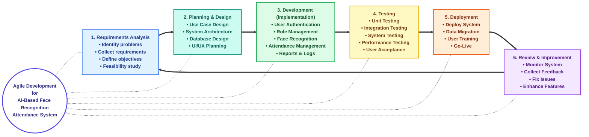
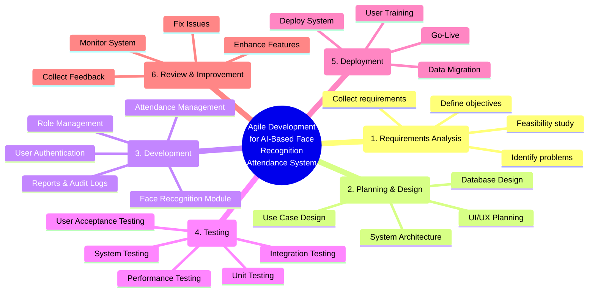

# Agile Development Diagrams

Here are two professional Mermaid diagrams representing the Agile Development lifecycle for your AI-Based Face Recognition Attendance System. You can copy and paste these into your GitHub `README.md` or any other Markdown-compatible documentation.

### 1. Cyclical Flowchart
This layout represents the continuous, looping nature of the Agile cycle.

### 2. Radial Mindmap
This layout provides a branching, centralized view of the phases, perfect for highlighting details.

