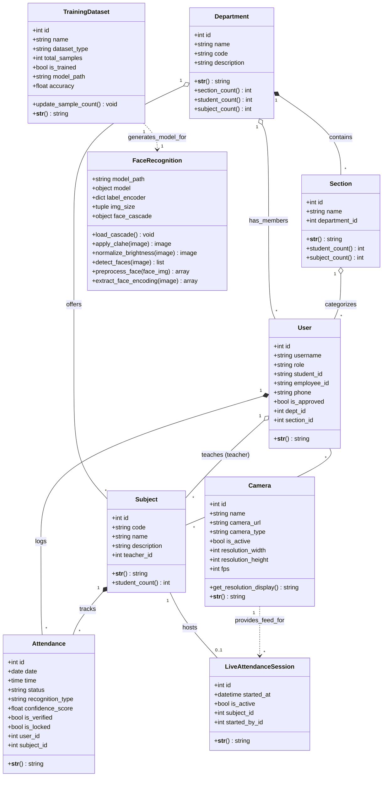

# Design Class Diagram

Here is the complete and professional Design Class Diagram for your AI Face Recognition Attendance System. 

It includes the classes, attributes, methods, and relationships mapping exactly to your Django backend (`models.py`) and your AI Recognition script (`face_recognition.py`).

You can paste this Mermaid code directly into GitHub, Notion, or any Markdown-compatible documentation tool.

