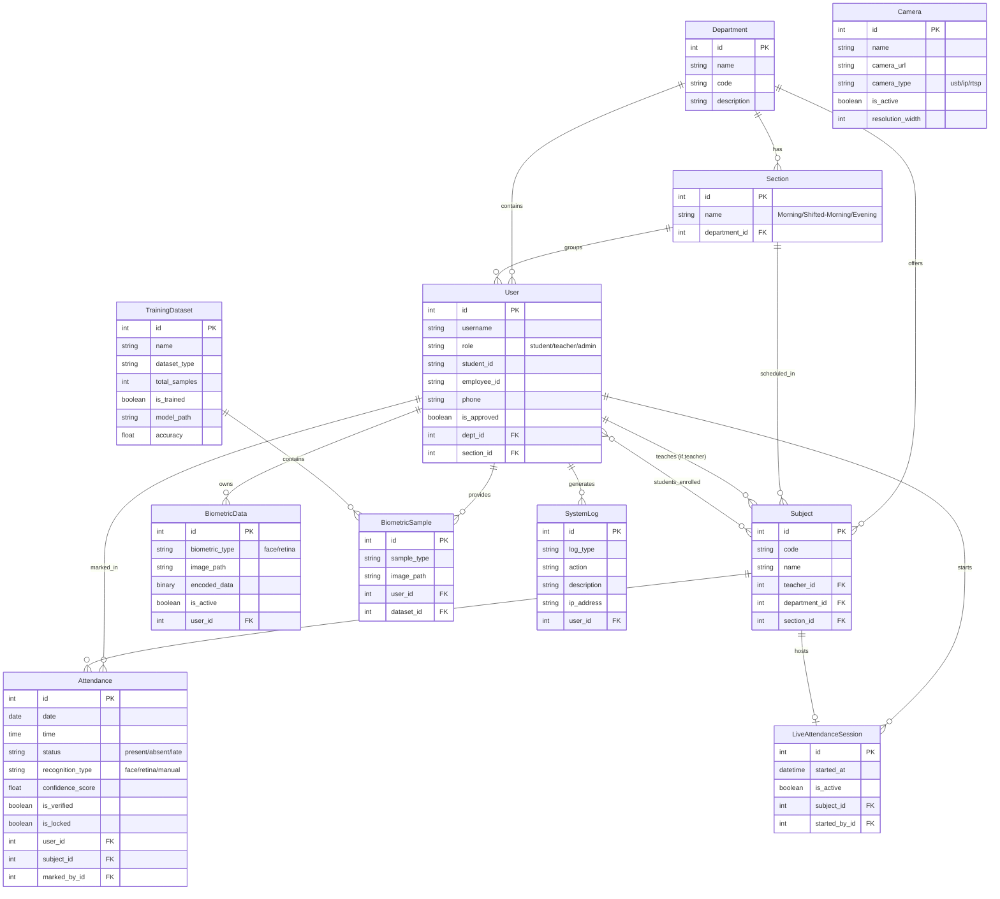

# Domain Model - Entity Relationship Diagram

Here is the perfect and professional Entity-Relationship diagram for your Face Recognition Attendance System, based directly on your Django `models.py`.

You can copy and paste this code block directly into your `README.md` or any GitHub markdown file.

