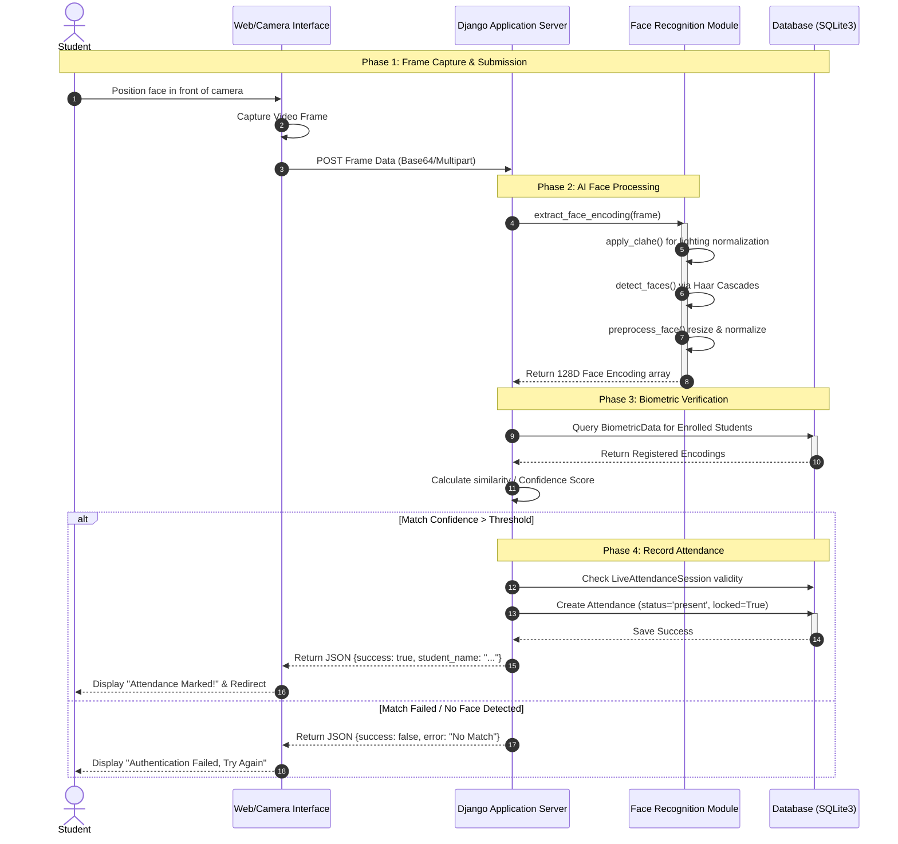

# System Sequence Diagram

Here is the professional Sequence Diagram detailing the exact step-by-step workflow of a student marking their attendance using your AI Face Recognition system.

You can paste this Mermaid code directly into GitHub, Notion, or any Markdown-compatible documentation tool.

